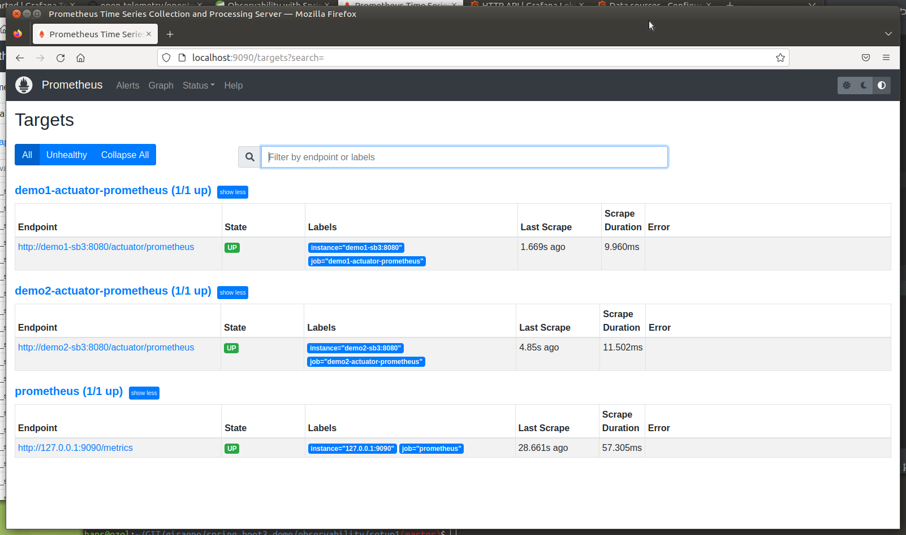
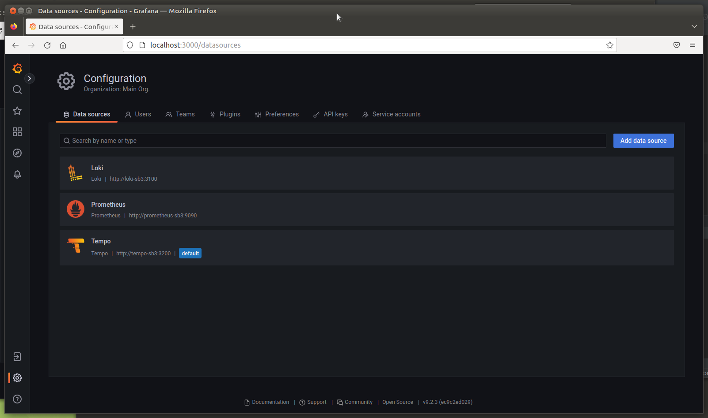
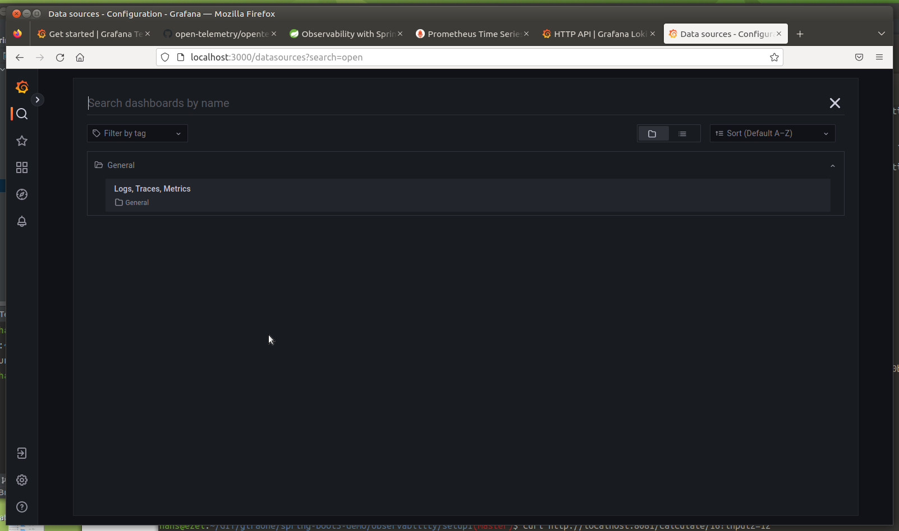
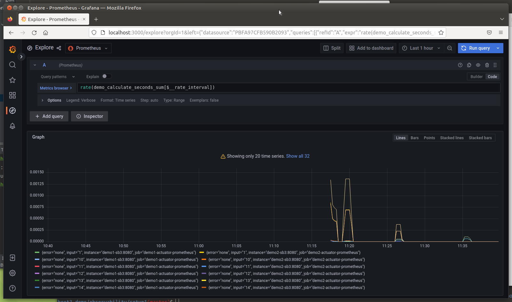
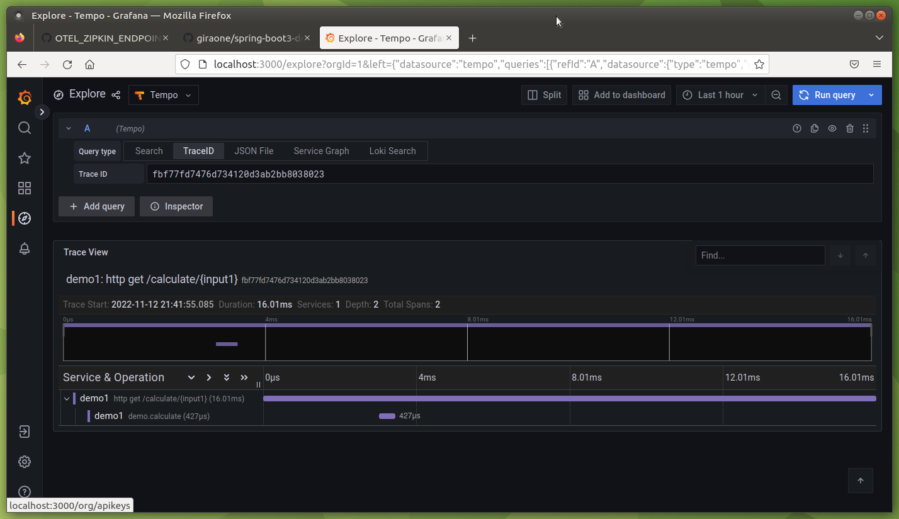
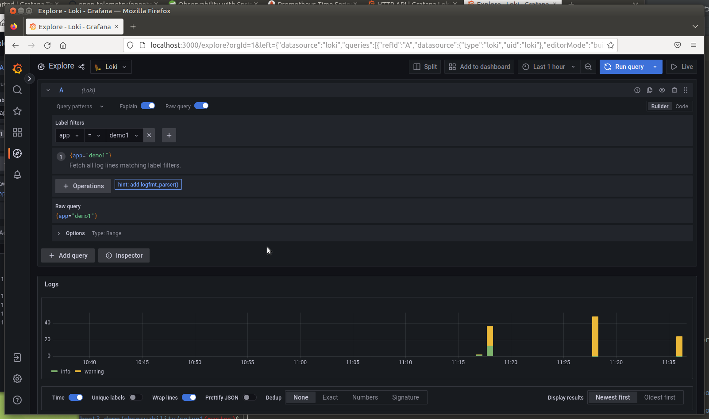

# Spring Boot 3 Features Demo

Basically the code from
[Spring Tips: the road to Spring Boot 3: Spring Framework 6](https://spring.io/blog/2022/10/26/spring-tips-the-road-to-spring-boot-3-spring-framework-6).

## Shows

- `@ControllerAdvice` with `ProblemDetail` (RFC 7807).
- Access to jakarta packages.
- Using metrics with `@Observed` and `ObservationRegistry/Observation`
- Interface based `WebClient`

## Content

There is one endpoint `/calculate/{input1}[?input2={input2}]` calculating the *fibonacci* value directly for `input1`
and also indirectly via a REST call to endpoint `/calculate2/{input}` to the same service.

## Tests from Command Line

### ProblemDetail

```shell
$ curl http://localhost:8080/calculate/0
{"type":"about:blank","title":"Bad Request","status":400,"detail":"PathVariable input1 must be between [1,30]","instance":"/calculate/0"}
```

### Calculations and interface based `WebClient`

```shell
curl http://localhost:8080/calculate/10
{"ok":true,"value1":55,"value2":0}

curl http://localhost:8080/calculate/10?input2=10
{"ok":true,"value1":55,"value2":21}
```

### Metrics and Observation

```shell
curl http://localhost:8080/actuator/metrics | jq
```

```json
{
  "names": [
    "application.ready.time",
    "application.started.time",
    "demo.calculate",
    "demo.calculate.active",
    "disk.free",
    "disk.total",
    ...
    "http.server.requests",
  ]
}
```

Using the "demo.calculate" metrics endpoint

```shell
curl http://localhost:8080/actuator/metrics/demo.calculate | jq
```

```json
{
  "name": "demo.calculate",
  "description": null,
  "baseUnit": "seconds",
  "measurements": [
    {
      "statistic": "COUNT",
      "value": 436
    },
    {
      "statistic": "TOTAL_TIME",
      "value": 0.038327775
    },
    {
      "statistic": "MAX",
      "value": 0
    }
  ],
  "availableTags": [
    {
      "tag": "error",
      "values": [
        "none"
      ]
    }
  ]
}
``` 

# Observability - Metrics, Tracing, Logs)

## Setup 1

See https://spring.io/blog/2022/10/12/observability-with-spring-boot-3

### Client Instrumentation

How is the Java Spring Boot 3 Application instrumented and where are the changes located?

- Metrics: `io.micrometer:micrometer-registry-prometheus` via changes in
  - [pom.xml](pom.xml) 
  - [application.yml](src/main/resources/application.yml) (`management.endpoints.web.exposure.include=prometheus`)
- Tracing: `io.micrometer:micrometer-tracing-bridge-otel` via changes in
  - [pom.xml](pom.xml)
- Logs: `com.github.loki4j:loki4j.logback.Loki4jAppender` via changes in
  - [pom.xml](pom.xml) 
  - [logback-spring.xml](src/main/resources/logback-spring.xml)

### Backends and Visualization

- Metrics: [Grafana](https://grafana.com/metrics/) via [Prometheus](https://prometheus.io/)
- Tracing: [Grafana Tempo](https://grafana.com/oss/tempo/) 
- Logs: [Grafana LOKI](https://grafana.com/oss/loki/)

## ## Setup 2

### Client Instrumentation

How is the Java Spring Boot 3 Application instrumented and where are the changes located?

- Tracing: `otel/opentelemetry-collector:0.63.0`
- `java -javaagent:path/to/opentelemetry-javaagent.jar  opentelemetry-javaagent.jar -jar myjar.jar`

---

## Run the setups

### Setup 1

This setup starts 6 containers using [setup1/docker-compose.yml](observability/setup1/docker-compose.yml).
There are two identical Spring Boot Services, the first `demo1-sb3` will call the second one `demo2-sb3`.

First you have to build the image for the Spring Boot demo application.

```shell
./mvnw -DskipTests=true package
podman build --tag=spring-boot3-demo:latest .
```

Start/Stop containers

```shell
cd observability/setup1
# Start
podman-compose up -d
# Stop
podman-compose down
```

Result

```
$ podman ps
CONTAINER ID  IMAGE                               COMMAND               CREATED        STATUS            PORTS                                             NAMES
57831ff4959b  docker.io/grafana/tempo:latest      -config.file=/etc...  2 minutes ago  Up 2 minutes ago  0.0.0.0:9411->9411/tcp, 0.0.0.0:42681->14268/tcp  tempo-sb3
d65bf12a5303  docker.io/grafana/loki:latest       -config.file=/etc...  2 minutes ago  Up 2 minutes ago  0.0.0.0:3100->3100/tcp                            loki-sb3
b5e83690fb4c  docker.io/prom/prometheus:latest    --enable-feature=...  2 minutes ago  Up 2 minutes ago  0.0.0.0:9090->9090/tcp                            prometheus-sb3
825fb780b271  docker.io/grafana/grafana:latest                          2 minutes ago  Up 2 minutes ago  0.0.0.0:3000->3000/tcp                            grafana-sb3
f04037417875  localhost/spring-boot3-demo:latest                        2 minutes ago  Up 2 minutes ago  0.0.0.0:8080->8080/tcp                            demo1-sb3
54d491ee7da2  localhost/spring-boot3-demo:latest                        2 minutes ago  Up 2 minutes ago  0.0.0.0:8081->8080/tcp                            demo2-sb3
```

### Check Services for Readiness

- Spring Boot Service 1:
  - Readiness: `curl http://localhost:8080/actuator/health`
  - Make call to Service 1: `curl http://localhost:8080/calculate/16?input2=12`
- Spring Boot Service 2:
  - Readiness: `curl http://localhost:8081/actuator/health`
  - Make call to Service 2: `curl http://localhost:8081/calculate/10`
- Prometheus:
  - Readiness: `curl http://localhost:9090/-/ready` ==> *Prometheus Server is Ready.*
  - [UI](http://localhost:9090/) - Use e.g. `demo_calculate_seconds_sum` as a query
  - [Management API Dokumentation](https://prometheus.io/docs/prometheus/latest/management_api/)
- Tempo:
  - Readiness: `curl http://localhost:3200/ready` ==> *ready*. If it is *Ingester not ready: ingester check ready failed waiting for 15s after being ready
*, then wait.
  - Port für Ingest: `curl http://localhost:9411/` ==> *unexpected end of JSON input*
  - [API Dokumentation](https://grafana.com/docs/tempo/latest/api_docs/)
- LOKI:
  - Readiness: `curl http://localhost:3100/ready` ==> *ready*
  - Test query: `curl -G -s  "http://localhost:3100/loki/api/v1/query" \
    --data-urlencode \
    'query=sum(rate({job="varlogs"}[10m])) by (level)' | jq`
  - [API Dokumentation](https://grafana.com/docs/loki/latest/api/)
- Grafana:
  - [UI](http://localhost:3000/)
  - [API Dokumentation](https://grafana.com/docs/grafana/latest/developers/http_api/)

### UIs

Prometheus Targets



Grafana Data Sources



Grafana Dashboards



Grafana Metrics (Prometheus)



Grafana Tracing (Tempo)



Grafana Logging (LOKI)



---- 

# What is good to know

- MDC https://github.com/open-telemetry/opentelemetry-java-instrumentation
- otel in docker/docker-compose https://github.com/open-telemetry/opentelemetry-java-instrumentation

Spring Boot 3
- Micrometer Tracing ersetzt spring-cloud-sleuth
- Damit sollte auch der "brave" Tracer Geschichte sein
- Das neue Micrometer System basiert bzgl. Header-Propagation auf der https://www.w3.org/TR/trace-context/ Spec. (traceparent und tracestate HTTP Header)
- Sichtbare "aktive" Basis im Code ist das Observation API (ObservationHandler, ObservationRegistry). Geht auch über Annotationen (@Observable), so ähnlich wie früher @Timed
- Siehe https://spring.io/blog/2022/10/12/observability-with-spring-boot-3


